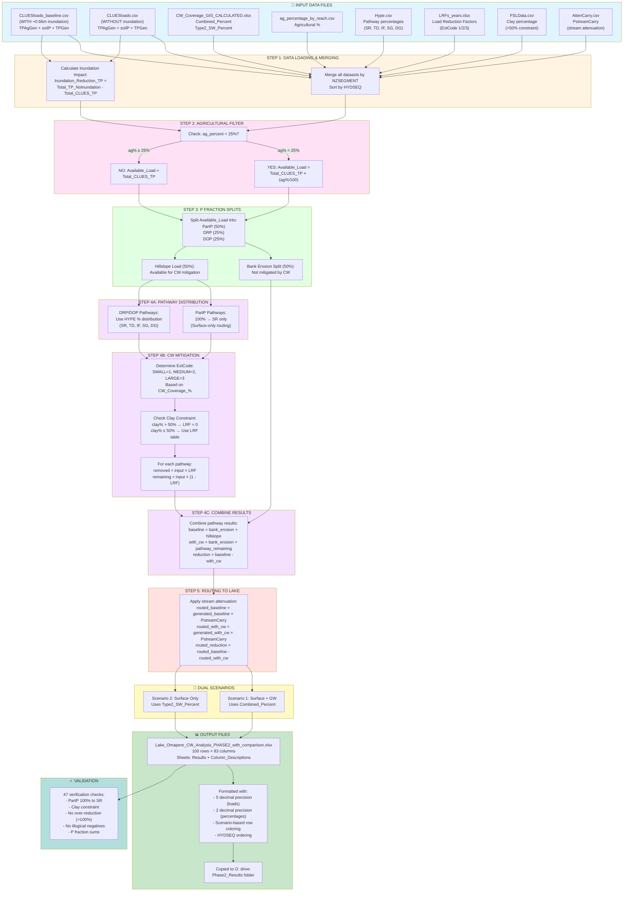

# Lake Omapere CW Analysis - Data Flow Workflow

## Complete Processing Pipeline: Input → Output

---

## Processing Summary

### Input Layer (8 files)
- **2 CLUES files** for inundation comparison
- **CW coverage data** (2 scenarios)
- **Agricultural percentages**
- **Pathway distributions** (HYPE)
- **Mitigation factors** (LRF)
- **Soil constraints** (Clay)
- **Stream routing** (Attenuation)

### Processing Pipeline

1. **Merge & Compare** → Calculate inundation impact (33.51% average reduction)
2. **Filter** → Apply agricultural 25% threshold (18 reaches affected)
3. **Split** → Divide into P fractions (PartP 50%, DRP 25%, DOP 25%) and sources (Bank/Hillslope)
4. **Distribute** → Route through pathways (**PartP special: 100% to SR only**)
5. **Mitigate** → Apply CW effectiveness with clay constraint (>50% → LRF=0)
6. **Route** → Apply stream attenuation to calculate lake delivery

### Dual Scenarios
- **Scenario 1:** Surface + GW (Combined_Percent coverage)
- **Scenario 2:** Surface Only (Type2_SW_Percent coverage)

### Output (83 columns)
- Identification & Scenario (3 cols)
- Input parameters (7 cols)
- **Inundation comparison (4 cols)** ← NEW!
- Generated/routed loads (12 cols)
- P fractions detail (57 cols)

### Final Result
**50 reaches × 2 scenarios = 100 output rows** with complete traceability from source data to final results.

---

**Date:** November 12, 2025
**Project:** TKIL2602 - Lake Omapere Modelling
**Version:** Phase 2 with Inundation Comparison
